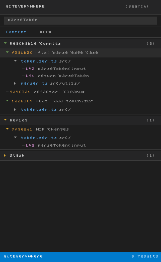

# GitEverywhere

GitEverywhere is a VSCode extension that lets you search your entire git history — not just the current branch, but branches, reflog, stash entries, dangling commits, dangling blobs, FETCH_HEAD, git notes, special heads (ORIG_HEAD, MERGE_HEAD, CHERRY_PICK_HEAD), and worktree heads — all from a single sidebar panel with live-streaming results.

## Scan Depths

| Depth | What is scanned | Typical speed |
|-------|----------------|---------------|
| **Fast** | All reachable commits (branches), reflog, stash | Seconds |
| **Deep** | Everything in Fast, plus dangling objects (fsck), FETCH_HEAD, git notes, special heads, worktree heads | 10–30 seconds |
| **Full** | Everything in Deep, plus the entire object store (all loose objects and pack files) | Slow on large repos — prompted with a warning if the repo has over 100,000 objects |

## Search Modes

| Mode | What it searches |
|------|-----------------|
| **Content** | Searches the diff content of every commit (uses `git log -S`) — finds commits that added or removed the string |
| **Commit message** | Searches commit messages (uses `git log --grep`) |
| **Filename / path** | Searches file paths recorded in each commit's tree — useful for finding when a file existed or was renamed |

## How to Use

1. Open the **GitEverywhere** panel in the Activity Bar (look for the git-branch icon).
2. Click the **Search Git History** button (magnifying glass) in the panel toolbar, or run the command `GitEverywhere: Search Git History` from the Command Palette (`Ctrl+Shift+P`).
3. Choose a **search mode**: Content, Commit message, or Filename / path.
4. Type your **search query** and press Enter.
5. Choose a **scan depth**: Fast, Deep, or Full.
6. Results stream into the sidebar in real time, grouped by source (reachable, reflog, stash, etc.).
7. Click any result to open the **Commit Detail panel**, which shows full metadata, branch information, and matched files.

## Action Buttons

From the Commit Detail panel you can:

- **Checkout to new branch** — creates a new branch at the selected commit and switches to it
- **Cherry-pick** — applies the commit's changes to the current branch
- **Restore file** — restores a specific file from the commit into the working tree
- **Copy SHA** — copies the full commit SHA to the clipboard (also available via right-click in the sidebar)
- **Show in terminal** — opens the integrated terminal with the commit SHA pre-filled

## FAQ

**Nothing found?**
Try a deeper scan depth. Fast only scans reachable commits; Deep adds dangling objects and special refs; Full scans everything. Also check your query — Content search is case-sensitive by default (same as `git log -S`).

**Why are some results shown with a warning icon?**
Results from non-reachable sources (reflog, stash, dangling commits) are highlighted with a warning icon because they may be garbage-collected by git at any time (`git gc`). Consider creating a branch to preserve important ones.

**Full scan is taking too long.**
Cancel the search with the stop-circle button in the toolbar, then try Deep depth instead. Full scan walks every object in the repository and can be slow on repos with millions of objects.

**WSL / Windows path issues?**
GitEverywhere normalizes paths returned by `git rev-parse --show-toplevel` using `path.normalize()`, which handles both forward-slash (POSIX/WSL) and backslash (Windows) separators correctly.

---

Contributions welcome — GitHub repo coming soon.
